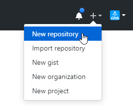
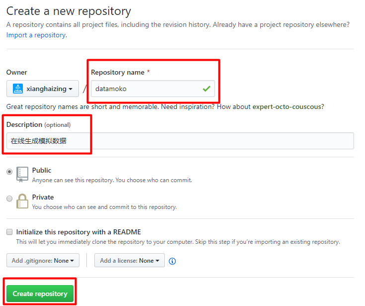
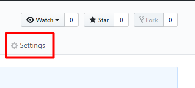
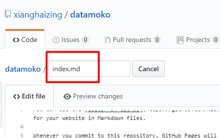
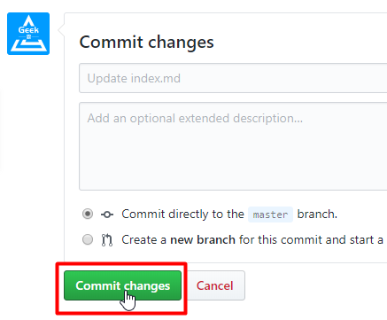
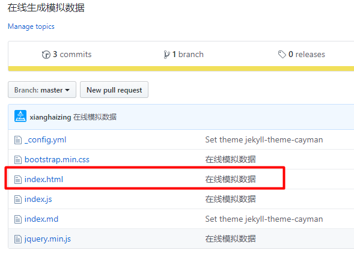

> [toc]

# 1. 登陆GitHub创建新仓库

创建仓库 **datamoko**

添加基本信息: 仓库名、仓库描述,然后点击创建

# 2. 设置页面预览
点击仓库设置

往下滑动页面,找到 **GitHub Pages** 设置,选择预览分支和模板

预览分支选择master

预览模板随便选一个

然后,会自动生成一个可预览的 **index.md**

直接提交

# 3. 上传html
库创建好后,克隆到本地.然后把写好的html、css、js文件,一起上传到仓库.
注意: 预览的html文件名必须为 **index.html**

# 4. 访问网页
还是在刚才Setting的GitHub Pages中,可以看到访问地址:https://xianghaizing.github.io/datamoko/

预览页面如下(偷偷的考诉你,js也能正常执行哦~~ ^_^):

在学习大数据的过程中,经常需要一些模拟数据.本着自己创造不求人的准则,开发了这个模拟数据的小功能.

欢迎食用,如果觉得不错可以在[GitHub](https://github.com/xianghaizing/datamoko)上点在支持哦!!!

- 预览地址: https://xianghaizing.github.io/datamoko/
- 仓库地址: https://github.com/xianghaizing/datamoko