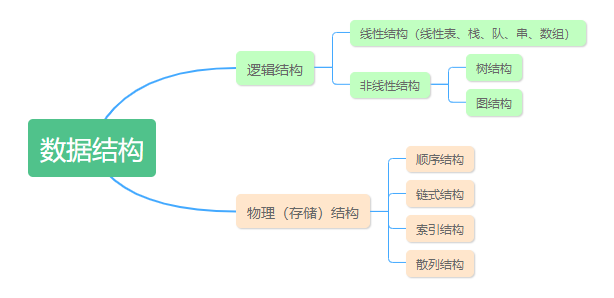
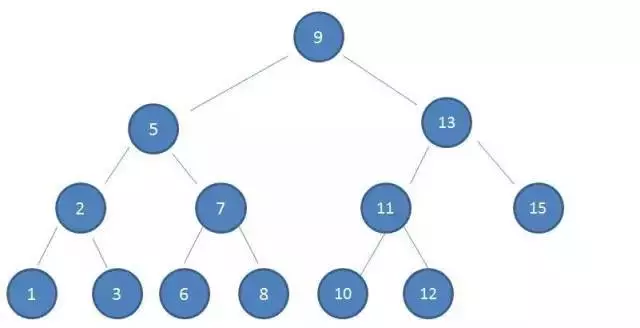
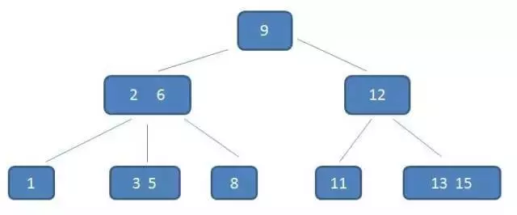

> [toc]

数据库的主要功能就是：`存数据`和`查询数据`，怎么存就不谈了，重点来看查询数据。
简单看一下数据结构的划分：

# hash和二叉树
使用hash查找，直接就是`key-value`非常快，时间复杂度O(1)；使用二叉树从算法上看，也是最优方案,时间复杂度O(logN)。但是，考虑到内存空间的问题，我们不可能**一次性**把所有数据都加载到内存，内存没有那么大。所以，数据库底层没有使用。
# 磁盘IO
使用二叉树查询时，**树高决定了磁盘IO的次数**。*树高，就是从根节点到子节点有多少级。* 树越高，发生的磁盘IO次数就越多，耗时就越长！所以，要减少耗费时间，就要**减少树的高度**。

# B-树
B-树主要就是解决了树高的问题，把瘦高的树变得矮胖一些。B-树和二叉树的主要区别就是：**中间节点存储的是值域边界**。

# B+树