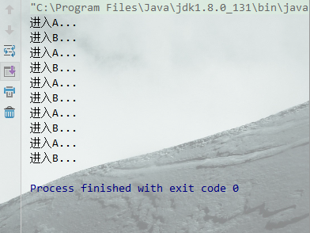
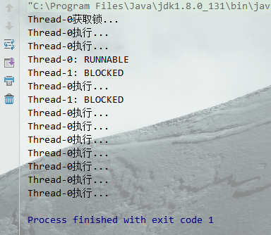
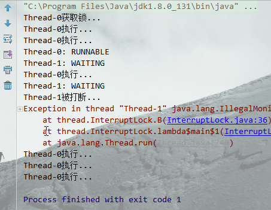
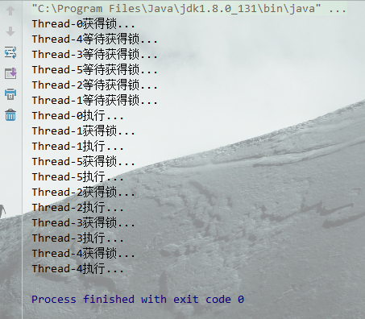
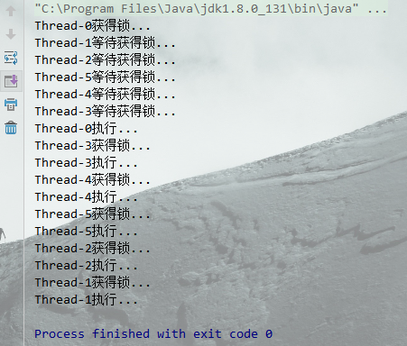
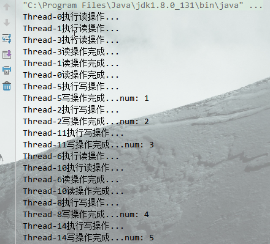
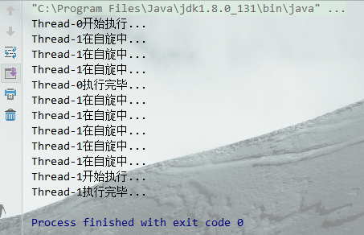

> [toc]

*搞明白 `线程` `锁`和`多线程`系列*

# 1.重入锁

在类中有 synchronized 方法A 和 synchronized 方法B,并**在A中调用B,就形成了重入锁**.获得A的对象锁,可以直接调用B,并不需要重新请求锁权限.

``` java
package thread;

/**
 * @Author lyf
 * @Date 2018/11/18 0018 14:30
 */
public class RepeatLock {
  
  public synchronized void A(){
    System.out.println("进入A...");
    B();
  }
  
  public synchronized void B(){
    System.out.println("进入B...");
  }
  
  public static void main(String[] args){
    RepeatLock repeatLock = new RepeatLock();
    for (int i = 0; i < 5; i++) {
      new Thread(()->{repeatLock.A();}).start();
    }
  }
}
```


# 2.中断锁

使用synchronized修饰的方法,在阻塞状态blocked时不能被外部打断,除非jvm报错.
使用ReentrantLock中的lockInterruptibly()处于阻塞状态时, 可以被打断.

``` java
package thread;

import java.util.concurrent.locks.ReentrantLock;

/**
 * @Author lyf
 * @Date 2018/11/18 0018 14:47
 */
public class InterruptLock {

  private ReentrantLock lock = new ReentrantLock();

  public synchronized void A() {
       try {
	System.out.println(Thread.currentThread().getName() + "获取锁...");
      while (true) {
        Thread.sleep(1000);
        System.out.println(Thread.currentThread().getName() + "执行...");
      }
    } catch (InterruptedException e) {
      e.printStackTrace();
    }
  }

  public static void main(String[] args) throws InterruptedException {
    
    InterruptLock lock1 = new InterruptLock();
    Thread t1 = new Thread(()->{lock1.A();});
    t1.start();
    Thread t2 = new Thread(()->{lock1.A();});
    t2.start();
    Thread.sleep(2000);
    System.out.println(t1.getName() + ": "+t1.getState());// RUNNABLE 正在运行
    System.out.println(t2.getName() + ": "+t2.getState());// BLOCKED 阻塞状态
    Thread.sleep(1000);
    t2.interrupt();// 打断t2线程
    System.out.println(t2.getName() + ": "+t2.getState());// 依然处于BLOCKED 阻塞状态
  }
}
```

线程0获取锁后, 线程1进入阻塞等待状态.对线程1调用interrupt()打断线程,发现没什么用!线程1还是在等待.

``` java
package thread;

import java.util.concurrent.locks.ReentrantLock;

/**
 * @Author lyf
 * @Date 2018/11/18 0018 14:47
 */
public class InterruptLock {

  private ReentrantLock lock = new ReentrantLock();


  public void B() {
    try {
      lock.lockInterruptibly();
      System.out.println(Thread.currentThread().getName() + "获取锁...");
      while (true) {
        Thread.sleep(1000);
        System.out.println(Thread.currentThread().getName() + "执行...");
      }
    } catch (InterruptedException e) {
      System.out.println(Thread.currentThread().getName() + "被打断...");
    } finally {
      lock.unlock();
    }
  }

  public static void main(String[] args) throws InterruptedException {
    
    InterruptLock lock2 = new InterruptLock();
    Thread t1 = new Thread(() -> { lock2.B(); });
    t1.start();
    Thread t2 = new Thread(() -> { lock2.B(); });
    t2.start();
    Thread.sleep(2000);
    System.out.println(t1.getName() + ": "+t1.getState());// RUNNABLE 正在运行
    System.out.println(t2.getName() + ": "+t2.getState());// WAITING 等待状态
    Thread.sleep(1000);
    t2.interrupt();// 打断t2线程
    System.out.println(t2.getName() + ": "+t2.getState());// WAITING 状态(线程延时)
  }
}
```

很明显线程1被打断...

# 3.公平锁

当多个线程处于阻塞状态时,由系统随机调度其中一个线程继续执行,无法保证公平性.有可能某个线程永远无法执行.ReentrantLock(true)可以创建公平锁,保证**每个阻塞的线程都可以被执行到**.

首先,来看非公平锁的情况,使用`new ReentrantLock()`创建:

``` java
package thread;

import java.util.concurrent.locks.ReentrantLock;

/**
 * @Author lyf
 * @Date 2018/11/18 0018 18:46
 */
public class FairLock {

  private ReentrantLock lock = new ReentrantLock();

  public synchronized void A() {
    lock.lock();
    System.out.println(Thread.currentThread().getName() + "获得锁...");
    try {
      Thread.sleep(5000);
      System.out.println(Thread.currentThread().getName() + "执行...");
    } catch (InterruptedException e) {
      e.printStackTrace();
    } finally {
      lock.unlock();
    }
  }

  public static void main(String[] args) throws InterruptedException {
    FairLock fairLock = new FairLock();
    new Thread(() -> {
      fairLock.A();
    }).start();// 启动线程获得锁

    for (int i = 0; i < 5; i++) {
      new Thread(() -> {
        System.out.println(Thread.currentThread().getName() + "等待获得锁...");
        fairLock.A();
      }).start();
    }
  }
}
```

线程0获得锁,线程 4 3 5 2 1 依次进入等待状态,在线程0执行完后,随机选择一个线程执行.

使用`new ReentrantLock(true)`创建公平锁

``` java
private ReentrantLock lock = new ReentrantLock(true);
```

线程0获得锁,**线程 1 2 5 4 3** 依次进入等待状态,在线程0执行完后,按照**顺序 3 4 5 2 1 执行**.

# 4.读写锁

多个线程执行读操作时,互不影响.但是读写互斥,写写互斥.

``` java
package thread;

import java.util.concurrent.locks.ReentrantReadWriteLock;

/**
 * @Author lyf
 * @Date 2018/11/18 0018 10:30
 */
public class MyReadWriteLock {

  private ReentrantReadWriteLock rwl = new ReentrantReadWriteLock();
  private int num = 0;

  public void readFile() {
    rwl.readLock().lock();
    try {
      System.out.println(Thread.currentThread().getName() + "执行读操作...");
      Thread.sleep((long) (Math.random() * 1000));
      System.out.println(Thread.currentThread().getName() + "读操作完成...");
    } catch (InterruptedException e) {
      e.printStackTrace();
    } finally {
      rwl.readLock().unlock();
    }
  }


  public void writeFile() {
    rwl.writeLock().lock();
    System.out.println(Thread.currentThread().getName() + "执行写操作...");
    try {
      num++;
      Thread.sleep((long) (Math.random() * 1000));
      System.out.println(Thread.currentThread().getName() + "写操作完成...num: " + num);
    } catch (InterruptedException e) {
      e.printStackTrace();
    } finally {
      rwl.writeLock().unlock();
    }

  }

  public static void main(String[] args) {

    MyReadWriteLock myReadWriteLock = new MyReadWriteLock();
    for (int i = 0; i < 5; i++) {
      new Thread(()->{myReadWriteLock.readFile();}).start();// 读语句1
      new Thread(()->{myReadWriteLock.readFile();}).start();// 读语句2
      new Thread(() -> { myReadWriteLock.writeFile(); }).start();// 写语句
    }
  }
}
```

* 线程0 1 3读操作同时开始,与线程5写操作互斥
* 线程5写操作与线程2写操作互斥

# 5.自旋锁

多线程下会造成线程处于阻塞状态,不能执行其他操作.自旋锁是一种非阻塞锁,允许线程等待期间执行其他操作,直到获得锁.

``` java
package thread;

import java.util.concurrent.atomic.AtomicReference;

/**
 * @Author lyf
 * @Date 2018/11/18 0018 20:23
 */
public class SpinLock {
  // CAS操作
  AtomicReference<Thread> runThread = new AtomicReference<>();

  public void lock() {
    Thread cur = Thread.currentThread();// 获取当前线程
    // 如果需要运行线程标志为null,也就是说现在没有线程在执行,就执行当前线程
    // 如果需要运行线程标志不为null,说明现在有线程在执行,就自己个儿执行自己的
    while (!runThread.compareAndSet(null, cur)) {
      try {
        Thread.sleep(500);
      } catch (InterruptedException e) {
        e.printStackTrace();
      }
      System.out.println(Thread.currentThread().getName() + "在自旋中...");
    }
    try {
      System.out.println(Thread.currentThread().getName() + "开始执行...");
      Thread.sleep(2000);
      System.out.println(Thread.currentThread().getName() + "执行完毕...");
    } catch (InterruptedException e) {
      e.printStackTrace();
    }
  }

  public void unlock() {
    Thread cur = Thread.currentThread();
    runThread.compareAndSet(cur, null);
  }
  
  public static void main(String[] args) {
      SpinLock spinLock = new SpinLock();
      Thread t1 = new Thread(()->{
        spinLock.lock();
        try {
          Thread.sleep(2048);
        } catch (InterruptedException e) {
          e.printStackTrace();
        }
        spinLock.unlock();
      });
      Thread t2 = new Thread(()->spinLock.lock());
      t1.start();
      t2.start();
  }
}
```


参考资料
* https://www.cnblogs.com/aspirant/p/6930436.html