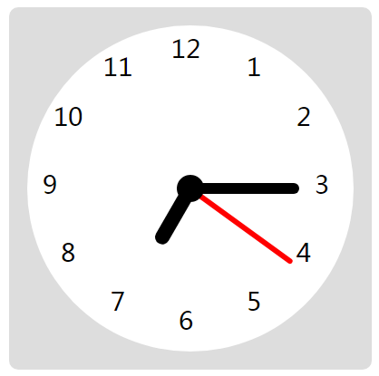

思路:

画时钟数字(x,y)坐标
``` makefile
x = x0 + r*cos(deg)
y = y0 + r*sin(deg)
```

知识点:
1. 创建元素: createElement
2. 添加元素: appendChild
3. css3旋转: transform:rotate(30deg);
4. css3改变旋转中心点: transform-origin:0 0;
5. 获取当前时间, 把时间数字转换为度数

``` html?linenums
<!DOCTYPE html>
<html lang="en">
<head>
    <meta charset="UTF-8">
    <title>Title</title>
    <style>
        * { margin: 0; padding: 0; }
        #bg {
            width: 400px;
            height: 400px;
            background: #ddd;
            border-radius: 10px;
            /* div上下左右垂直居中 */
            position: absolute;
            left: 50%;
            top: 50%;
            margin-top: -200px;
            margin-left: -200px;
        }

        #bg #clock {
            width: 360px;
            height: 360px;
            background: #fff;
            border-radius: 50%;
            display: inline-block;
            margin: 20px;
            position: relative;
        }

        #hour {
            width: 70px;
            height: 16px;
            background: #000;
            position: absolute;
            left: 180px;
            top: 172px;
            border-radius: 16px;
            transform-origin:0 8px;
        }
        #minute {
            width: 120px;
            height: 12px;
            background: #000;
            position: absolute;
            left: 180px;
            top: 174px;
            border-radius: 12px;
            transform-origin:0 6px;
        }
        #second {
            width: 140px;
            height: 6px;
            background: #f00;
            position: absolute;
            left: 180px;
            top: 177px;
            border-radius: 6px;
            transform-origin:0 1px;
            /*transform:rotate(30deg);*/
            /*animation: clockRotate 3s linear infinite;*/
        }

        @keyframes clockRotate {
            from {transform:rotate(0deg);}
            to {transform:rotate(360deg);}
        }

        #point{
            width: 30px;
            height: 30px;
            border-radius: 50%;
            background: #000;
            position: absolute;
            left: 50%;
            top: 50%;
            margin: -15px 0 0 -15px;
        }

        #clock .number{
            position: absolute;
            font-size: 28px;
            width: 50px;
            height: 50px;
            line-height: 50px;
            text-align: center;
        }
    </style>
</head>
<body>
<div id="bg">
    <div id="clock">
        <div id="hour"></div>
        <div id="minute"></div>
        <div id="second"></div>
        <div id="point"></div>
    </div>
</div>

<script>
    var clock = document.getElementById('clock');
    var r = 150;
    var angle = Math.PI * 2; // 2PI = 360°
    for (var i = 1; i <=12; i++) {
        var deg = angle/12 * i - Math.PI/2;
        var x = r + r*Math.cos(deg);
        var y = r + r*Math.sin(deg);
        //console.log(x,y);
        var num = document.createElement('div');//创建div
        num.className = 'number';//设置class样式
        num.innerText = i;
        //设置坐标
        num.style.top = y + 'px';
        num.style.left = x + 'px';
        //添加
        clock.appendChild(num);
    }

    //TODO 1. 数字转换度数
    function run() {
        var date = new Date();
        //时(0-23) 分(0-59)秒(0-59)
        var hour = date.getHours();
        var minute = date.getMinutes();
        var second = date.getSeconds();

        var hourDeg = 360/12 * hour - 90;
        var minuteDeg = 360/60 * minute - 90;
        var secondDeg = 360/60 * second - 90;

        var hourDiv = document.getElementById('hour');
        var minuteDiv = document.getElementById('minute');
        var secondDiv = document.getElementById('second');

        hourDiv.style.transform = 'rotate('+hourDeg+'deg)';
        minuteDiv.style.transform = 'rotate('+minuteDeg+'deg)';
        secondDiv.style.transform = 'rotate('+secondDeg+'deg)';
    }

    //TODO 2. 设置定时器
    run();
    setInterval(function () {
        run();
    },1000);
</script>
</body>
</html>
```