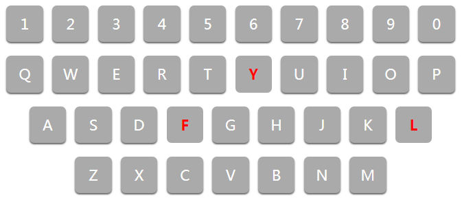

通过js模拟键盘按压效果
``` html
<!DOCTYPE html>
<html lang="en">
<head>
    <meta charset="UTF-8">
    <title>Title</title>
    <style>
        *{margin: 0;padding: 0;}
        .btn{
            width:80px;
            height: 80px;
            background: #aaa;
            border-radius: 10px;
            font-size: 32px;
            color: #fff;
            line-height: 80px;
            text-align: center;
            box-shadow: 0 3px 3px #666;
            cursor: pointer;/* 手型 */
            transition: all .3s;
            display: inline-block;
            margin: 15px 10px;
        }
        .btn:hover{
            box-shadow: 0 0 0 #666;
            color: #f00;
            font-weight: bold;
        }
        .line{
            text-align: center;
        }
    </style>
</head>
<body>
<script>
    /**
     * 键盘按下按键, 页面对应的按钮有被按下的效果
     * */
    var array = [
        [1,2,3,4,5,6,7,8,9,0],
        ['Q','W','E','R','T','Y','U','I','O','P'],
        ['A','S','D','F','G','H','J','K','L'],
        ['Z','X','C','V','B','N','M']
    ];

    // 遍历二维数组
    for (var i = 0; i < array.length; i++) {
        var line = document.createElement('div');// 创建父级div
        line.className = 'line';//添加样式
        for (var j = 0; j < array[i].length; j++) {
            var btn = document.createElement('div');//创建按钮btn
            btn.className = 'btn';//添加样式
            btn.innerHTML = array[i][j]; //设置显示文本
            line.appendChild(btn);//把按钮放入父元素中
        }
        document.body.appendChild(line);//添加到body中, 页面就可以显示了
    }

    /***
     * 思路:
     * 1. 确定按下的是哪个键(每个键有唯一的keycode),获取keycode数组
     * 2. 按键获取按钮的keycode并得到在keycode数组中的位置
     * */

    var keycodeArr = [49, 50, 51, 52, 53, 54, 55, 56, 57, 48, 81, 87, 69, 82, 84, 89, 85, 73, 79, 80, 65, 83, 68, 70, 71, 72, 74, 75, 76, 90, 88, 67, 86, 66, 78, 77];
    var btns = document.getElementsByClassName('btn');
    //console.log(keycodeArr.length, btns.length);
    document.onkeydown = function (e) {
        //console.log(e.keyCode);
        var keycode = e.keyCode;//获取键盘码
        //找位置
        var index = keycodeArr.indexOf(keycode);//获取对应的位置
        //console.log(index);
        //console.log(btns[index]);
        var btn = btns[index];
        btn.style.color = 'red';
        btn.style.boxShadow = '0 0 0 #666';
        btn.style.fontWeight = 'bold';
    }
    document.onkeyup = function (e) {
        var keycode = e.keyCode;//获取键盘码
        var index = keycodeArr.indexOf(keycode);//获取对应的位置
        var btn = btns[index];
        btn.style.color = '#fff';
        btn.style.boxShadow = '0 3px 3px #666';
        btn.style.fontWeight = 'normal';
    }

</script>
</body>
</html>
```