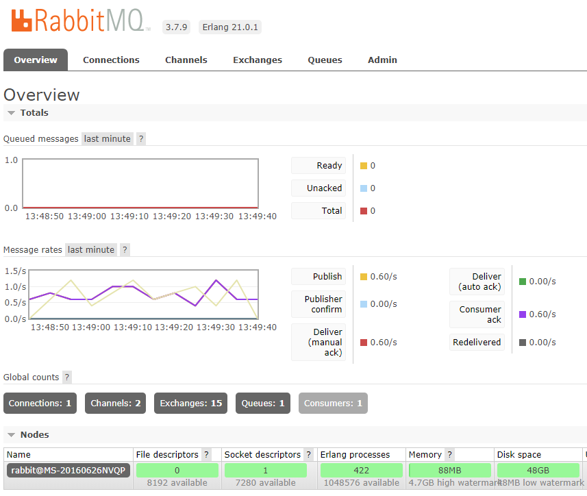

> [toc]

通过消息队列MQ做为通信中心,这里采用RabbitMQ.安装方参考: https://www.cnblogs.com/linyufeng/p/9883905.html
也可以采用windows环境(建议初学者采用)
1. [下载Erlang](http://www.erlang.org/downloads)
2. [下载RabbitMQ](https://github.com/rabbitmq/rabbitmq-server/releases/download/v3.7.9/rabbitmq-server-3.7.9.exe)

启动服务并启动web访问界面
- linux启动 `rabbitmq-plugins enable rabbitmq_management`
- windows启动 `rabbitmq-plugins.bat enable rabbitmq_management`

访问 http://localhost:15672/ 并登陆, 默认用户名和密码都是`guest`

*Hello World 代码示例*

# pom.xml

``` xml
<!-- rabbitmq 客户端 -->
<dependency>
    <groupId>org.springframework.boot</groupId>
    <artifactId>spring-boot-starter-amqp</artifactId>
</dependency>
```

# application.yml

``` yaml
spring:
  application:
    name: rabbitmq-hello
  # 以下都是默认配置
  rabbitmq:
    host: localhost
    port: 5672
    username: guest
    password: guest
```

# 提供者

``` java
@Component
public class Sender {
  
  @Autowired
  private AmqpTemplate template;
  
  public void send(){
    String msg = "hello: "+new Date().toString();
    System.out.println("Sender: " + msg);
    this.template.convertAndSend("hello", msg);
  }
  
}
```

# 消费者

``` java
@Component
public class Receiver {

  @RabbitListener(queues = "hello")
  public void process(String hello){
    System.out.println("Reciver: "+ hello);
  }
}
```

# 队列配置

``` java
@Configuration
public class RabbitConfig {
  
  @Bean
  public Queue queue(){
    return new Queue("hello");
  }
  
}
```

# 单元测试

``` java
@RunWith(SpringRunner.class)
@SpringBootTest
public class RabbitmqHelloApplicationTests {

  @Autowired
  private Sender sender;
  
  @Test
  public void contextLoads() throws InterruptedException {
    for (int i = 0; i < 1000; i++) {
      Thread.sleep((long) (Math.random()*3000));
      sender.send();
    }
  }

}
```


运行单元测试, 控制台打印:
> Sender: hello: Wed Dec 26 13:46:35 GMT+08:00 2018
Reciver: hello: Wed Dec 26 13:46:35 GMT+08:00 2018
Sender: hello: Wed Dec 26 13:46:37 GMT+08:00 2018
Reciver: hello: Wed Dec 26 13:46:37 GMT+08:00 2018
Sender: hello: Wed Dec 26 13:46:38 GMT+08:00 2018
Reciver: hello: Wed Dec 26 13:46:38 GMT+08:00 2018




